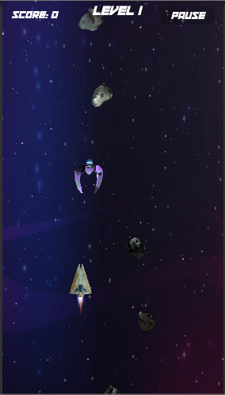
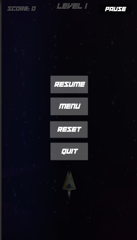
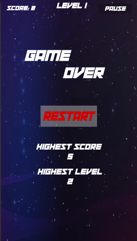

SpaceShooter

1.It is a touch based arcade game developed for android mobile devices. The assets are taken from unity asset store. Then touch functionality, different buttons including 'pause', 'menu', 'sound on/off', 'reset','restart','quit' buttons were added. 
2.Game level has also been added. After each level hazard (i.e asteroids, enemies) count increses by 5 and it keeps increasing in each level. 

  

3.When the player dies and the game is over, highest level survived and highest scores are shown. 

 
